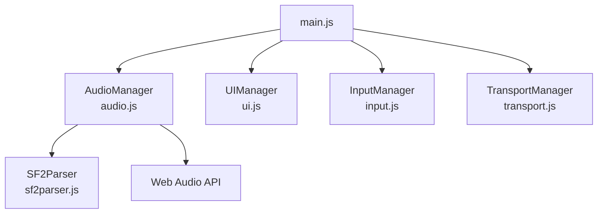
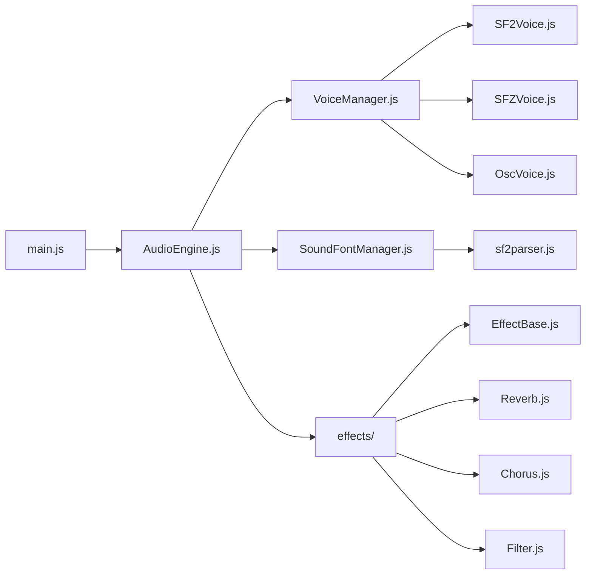
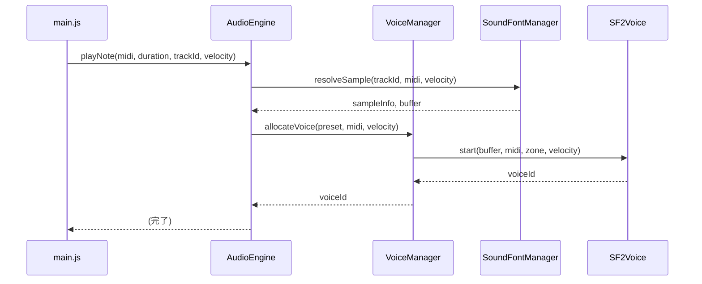
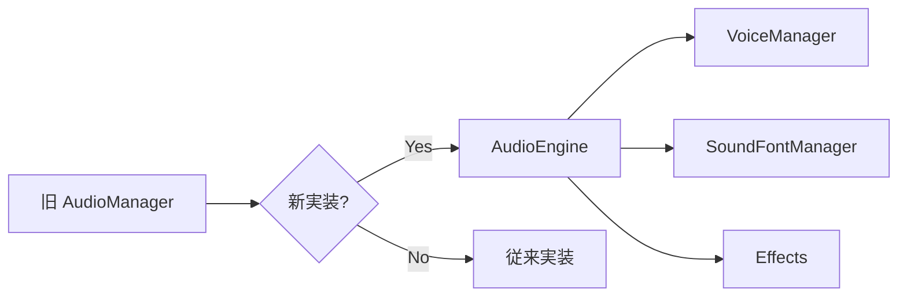

# Android MIDI アプリ サウンドフォント強化 アーキテクチャ設計書

## 1. 現状分析

### 1.1 既存コンポーネント構造

現在のシステムは [`main.js`](main.js) をエントリポイントとして、以下の主要コンポーネントで構成されています：



### 1.2 現在の [`AudioManager`](audio.js) の課題

| 項目 | 現状 | 課題 |
|------|------|------|
| **サウンドフォント読み込み** | SF2/SFZ を単一ファイルのみ対応 | 複数サウンドフォントの管理不可 |
| **ボイス管理** | 単発音単位での制御なし | 同時発音数の上限なし |
| **エンベロープ** | 単純な AD/AR のみ | 本格的な ADSR 未実装 |
| **フィルター** | なし | 音色の変化が限定的 |
| **エフェクト** | なし | リバーブ、コーラス等の拡張不可 |
| **エラーハンドリング** | 基本ロガーのみ | ユーザーに優しいエラーメッセージ不足 |

### 1.3  [`sf2parser.js`](sf2parser.js) の機能

- RIFF/SF2 ヘッダーパース
- プリセット・楽器・サンプルデータの抽出
- ゾーンとジェネレータの解決
- ノート単位のサンプル選択ロジック

---

## 2. 推奨アーキテクチャ

### 2.1 新しいファイル構成

```
android_midi_app/
├── audio/                          # 新しいオーディオディレクトリ
│   ├── AudioEngine.js              # メインオーディオエンジン（ facade ）
│   ├── VoiceManager.js             # ボイス管理（同時発音数制御）
│   ├── SoundFontManager.js         # サウンドフォント管理・プリセット解決
│   ├── effects/
│   │   ├── EffectBase.js           # エフェクト基底クラス
│   │   ├── Reverb.js               # コンボルーションリバーブ
│   │   ├── Chorus.js               # コーラス
│   │   └── Filter.js               # マルチモードフィルター
│   └── voices/
│       ├── SF2Voice.js             # SF2 用ボイス
│       ├── SFZVoice.js             # SFZ 用ボイス
│       └── OscVoice.js             # オシレーターボイス
├── audio.js                        # 既存の AudioManager（移行用ラッパー）
├── sf2parser.js                    # 既存（SoundFontManager から参照）
├── main.js                         # 既存
├── ui.js                           # 既存
└── index.html                      # 既存
```

### 2.2 推奨インポート構造



### 2.3 クラス設計

#### 2.3.1 [`AudioEngine`](audio/AudioEngine.js)

```javascript
export class AudioEngine {
    constructor() {
        this.ctx = null;
        this.masterGain = null;
        this.voiceManager = null;
        this.soundFontManager = null;
        this.effects = {
            reverb: null,
            chorus: null,
            filter: null
        };
        this.initialized = false;
    }
    
    async init() {
        // Web Audio Context 初期化
        // VoiceManager, SoundFontManager 初期化
        // エフェクトチェーン構築
    }
    
    async loadSoundFont(file) {
        // サウンドフォント読み込み委譲
    }
    
    playNote(midi, duration, trackId, velocity) {
        // VoiceManager に再生委譲
    }
    
    getPresets() {
        // SoundFontManager に委譲
    }
}
```

#### 2.3.2 [`VoiceManager`](audio/VoiceManager.js)

```javascript
export class VoiceManager {
    constructor(ctx, maxVoices = 64) {
        this.ctx = ctx;
        this.maxVoices = maxVoices;
        this.activeVoices = new Map(); // voiceId -> Voice instance
        this.voicePool = []; // 音声再利用プール
    }
    
    play(preset, midi, velocity, trackId) {
        // 同時発音数チェック
        // ボイス割り当て（優先度ベースの解放）
        // 音声再生開始
    }
    
    stop(voiceId) {
        // リリースフェーズ開始
        // ボイスプーリング
    }
    
    panic() {
        // 全ボイス即時停止
    }
}
```

#### 2.3.3 [`SoundFontManager`](audio/SoundFontManager.js)

```javascript
export class SoundFontManager {
    constructor() {
        this.parsers = new Map(); // fontId -> SF2Parser
        this.buffers = new Map(); // fontId -> Map<sampleIndex, AudioBuffer>
        this.activePresets = new Map(); // trackId -> { fontId, presetIndex }
    }
    
    async loadFont(file) {
        // ファイルパース
        // サンプルデコード（ストリーミング対応）
        // fontId 割り当て
    }
    
    resolveSample(preset, midi, velocity) {
        // ゾーン解決
        // 正しいサンプルの選択
        // ループポイント計算
    }
    
    unloadFont(fontId) {
        // リソース解放
    }
}
```

#### 2.3.4 [`SF2Voice`](audio/voices/SF2Voice.js)

```javascript
export class SF2Voice {
    constructor(ctx, output) {
        this.ctx = ctx;
        this.output = output;
        this.source = null;
        this.envelope = null;
        this.filter = null;
    }
    
    start(sampleBuffer, midi, zone, velocity) {
        // AudioBufferSource 設定
        // ピッチ計算（rootKey, coarseTune, fineTune）
        // エンベロープ生成（ADSR）
        // フィルター設定
        // 出力接続
    }
    
    release() {
        // エンベロープ.release() 呼び出し
        // リリース完了後にdestroy()
    }
    
    destroy() {
        // リソース解放
    }
}
```

---

## 3. 実装フェーズ計画

### フェーズ 1：基盤構築（Week 1）

| タスク | ファイル | 説明 |
|--------|----------|------|
| [ ] ディレクトリ作成 | `audio/` | audio ディレクトリ作成 |
| [ ] AudioEngine クラス実装 | `audio/AudioEngine.js` | Web Audio Context 管理、ファサード |
| [ ] VoiceManager クラス実装 | `audio/VoiceManager.js` | 同時発音数制御、ボイスプール |
| [ ] 既存 AudioManager 移行 | `audio.js` | 新エンジンへの委譲ラッパー作成 |
| [ ] main.js 更新 | `main.js` | 新インポートパスへの変更 |

### フェーズ 2：サウンドフォント管理（Week 2）

| タスク | ファイル | 説明 |
|--------|----------|------|
| [ ] SoundFontManager 実装 | `audio/SoundFontManager.js` | 複数フォント管理、プリセット解決 |
| [ ] ストリーミングデコード対応 | `SoundFontManager.js` | AudioBuffer 遅延ロード |
| [ ] サンプルキャッシュ機能 | `SoundFontManager.js` | メモリ管理、LRU キャッシュ |
| [ ] プリセットブラウザ機能 | `ui.js` 拡張 | サウンドフォント内のプリスト一覧表示 |

### フェーズ 3：ボイス実装（Week 3）

| タスク | ファイル | 説明 |
|--------|----------|------|
| [ ] SF2Voice 実装 | `audio/voices/SF2Voice.js` | SF2 向けボイス、ADSR エンベロープ |
| [ ] フィルター実装 | `audio/voices/SF2Voice.js` | ローパス/ハイパスフィルター |
| [ ] SFZVoice 実装 | `audio/voices/SFZVoice.js` | SFZ 向けボイス |
| [ ] OscVoice 実装 | `audio/voices/OscVoice.js` | フォールバック用オシレーター |
| [ ] ビルトインプリセット | `audio/presets/` | バックアップ用基本音色 |

### フェーズ 4：エフェクト（Week 4）

| タスク | ファイル | 説明 |
|--------|----------|------|
| [ ] EffectBase 実装 | `audio/effects/EffectBase.js` | エフェクト基底クラス |
| [ ] Reverb 実装 | `audio/effects/Reverb.js` | コンボルーションリバーブ |
| [ ] Chorus 実装 | `audio/effects/Chorus.js` | コーラス（-delay/FB） |
| [ ] Filter 実装 | `audio/effects/Filter.js` | マルチモードフィルター |
| [ ] エフェクトチェーン | `AudioEngine.js` | マスターチェーンへの接続 |

### フェーズ 5：品質向上（Week 5）

| タスク | ファイル | 説明 |
|--------|----------|------|
| [ ] エラーハンドリング強化 | 全体 | ユーザー向けエラーメッセージ |
| [ ] ローディングUI | `ui.js` | 読み込み中のプログレス表示 |
| [ ] プリセット検索 | `SoundFontManager.js` | 名前でのフィルター機能 |
| [ ] パフォーマンステスト | - | 同時発音数ストレステスト |
| [ ] ドキュメント更新 | `README.md` | API ドキュメント |

---

## 4. インポート構造の詳細

### 4.1 新しいインポートパス（main.js 更新後）

```javascript
// main.js での新しいインポート
import { AudioEngine } from './audio/AudioEngine.js';

// 従来の AudioManager は後方互換性のため残存
import { AudioManager } from './audio.js';
```

### 4.2 AudioEngine から各コンポーネントへの委譲



---

## 5. 後方互換性の確保

### 5.1 既存 API 維持

[`audio.js`](audio.js) は以下の API を維持し、内部で新エンジンを使用：

```javascript
// 既存の API（変更なし）
audioManager.loadSF2(file);
audioManager.loadSFZ(files);
audioManager.playNote(midi, duration, trackId, velocity);
audioManager.setTrackInstrument(trackId, bank, program, presetIndex);
audioManager.getPresets();
```

### 5.2 移行パス



---

## 6. 技術的考慮事項

### 6.1 メモリ管理

- **ストリーミングデコード**: 大規模 SF2 ファイルは全サンプルをメモリに保持せず、必要に応じてデコード
- **LRU キャッシュ**: 最近使用されたサンプルバッファを優先保持
- **ボイスプール**: 音声オブジェクトの再利用でガベージコレクション負荷軽減

### 6.2 パフォーマンス

- **Web Audio API** のネイティブノード使用で低遅延再生
- **オフスクリーンレンダリング**: UI スレッド блокировка 回避
- **Worker スレッド**: パース処理を別スレッドで実行（オプション）

### 6.3 ブラウザ互換性

- **AudioContext**: 標準および webkit 接頭辞対応
- **SharedArrayBuffer**: 将来的なマルチスレッド対応（COOP/COEP 考慮）

---

## 7. 次のステップ

1. **フェーズ 1 実装開始**: ディレクトリ作成と AudioEngine クラスの実装
2. **Code モードへの切り替え**: 実装タスクの委任
3. **テスト計画策定**: 単体テスト・統合テストの設計

---

*文書作成日: 2024-01-12*
*バージョン: 1.0*
